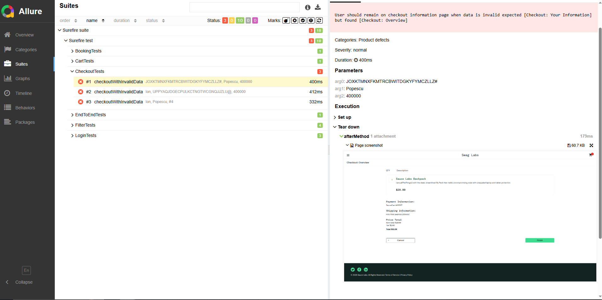

📌 SauceDemo Automation Framework

Automated Test Suite for SauceDemo (E‑Commerce Web Application)
This framework automates testing of the SauceDemo application using Java + Selenium + TestNG, with Allure reporting and CI/CD integration. It follows best practices in automation design: Page Object Model (POM), data-driven testing, parallel execution, and detailed failure reporting.

## 🏷️ Badges

  
  

⚠ Allure automatically captures screenshots on every failed test in the @AfterMethod

---

## ⚙️ Tech Stack

| Technology / Tool       | Purpose                                                    |
| ----------------------- | ---------------------------------------------------------- |
| Java                    | Main programming language                                  |
| Selenium WebDriver      | UI automation                                              |
| TestNG                  | Test runner and suite management                           |
| Maven                   | Build & dependency management                              |
| Allure Reports          | Detailed reporting, including screenshots for failed tests |
| JSON                    | Data-driven testing (test data)                            |
| GitHub Actions          | CI/CD and automated test execution                         |
| Branch `parallel-tests` | Parallel test execution for optimization                   |

---

## 📂 Project Structure
saucedemo-Automation/
├── src
│   ├── main/java
│   │   ├── driver/…               # WebDriver Factory & Wait utils
│   │   ├── pages/…                # Page Object Model classes
│   │   └── testData/…             # JSON test data & classes
│   └── test/java
│       ├── tests/…                # Test classes
│       └── BaseTests.java         # Base test setup with driver, waits, Allure screenshots
├── pom.xml                         # Maven configuration
├── testng.xml                       # TestNG suite (parallel-enabled)
└── README.md

---

🧪 Test Coverage
- **Login** – positive, negative, and locked user scenarios  
- **Cart functionality** – add/remove items, validations  
- **Checkout** – end-to-end checkout scenarios  
- **Data-driven testing** – using JSON files for users and checkout data  
- **Parallel execution** – reduces test runtime with thread-safe WebDriver  
- **Allure reporting** – automatically captures screenshots in `@AfterMethod` for failed tests  

**Sample test flows:**

- Login → Add item → Checkout → Order confirmation  
- Login → Invalid credentials → Error message  
- Locked user login → Proper error displayed  

---

## 🚀 Setup & Execution

1️⃣ Clone Repository

git clone https://github.com/MihaiS13/saucedemo-Automation.git
cd saucedemo-Automation

2️⃣ Compile & Run Tests

mvn clean compile
mvn clean test

TestNG will execute tests according to the suite defined in testng.xml.

3️⃣ Allure Reporting

After test execution:
allure generate ./allure-results --clean
allure open

Allure reports include:

Executed test cases and their statuses
Trends and statistics
Screenshots automatically captured for failed tests (captured in @AfterMethod)

🔧 Parallel Testing

The TestNG suite (testng.xml) is configured for parallel execution:
<suite name="SauceDemo Suite" parallel="methods" thread-count="2">
    <test name="All Tests">
        <packages>
            <package name="test"/>
        </packages>
    </test>
</suite>

Reduces overall test execution time
Each test runs independently using ThreadLocal WebDriver
Branch dedicated for parallel tests: parallel-tests

🔹 CI/CD (GitHub Actions)
Tests run automatically on each push or pull request
Generates Allure report automatically
Workflow tested on Windows and Linux

Badge example:
 

💡 Best Practices Demonstrated
Page Object Model (POM) design
Data-driven testing using JSON files
Parallel execution using TestNG and ThreadLocal WebDriver
Detailed reporting with screenshots
CI/CD automation via GitHub Actions

📌 Conclusion

This project is a professional automation framework suitable for:

Showcasing in CV or LinkedIn
Demonstrating end-to-end test automation skills
Parallel testing & data-driven scenarios
Continuous Integration with automated reporting

Key Highlights for recruiters:

End-to-end test automation
Parallel execution & JSON data-driven testing
CI/CD integrated with Allure reporting
Scalable and maintainable automation framework
